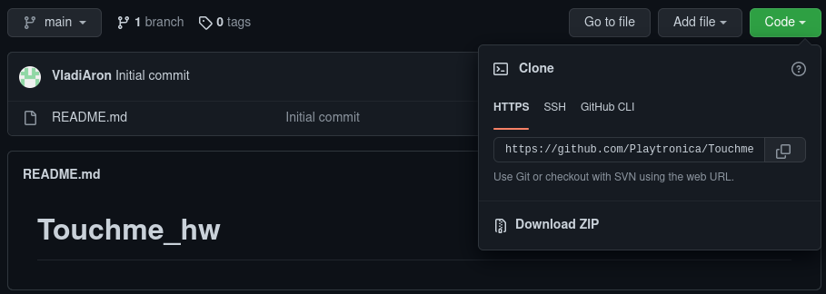
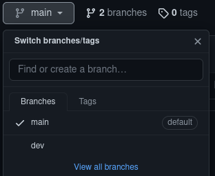
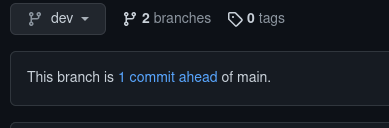
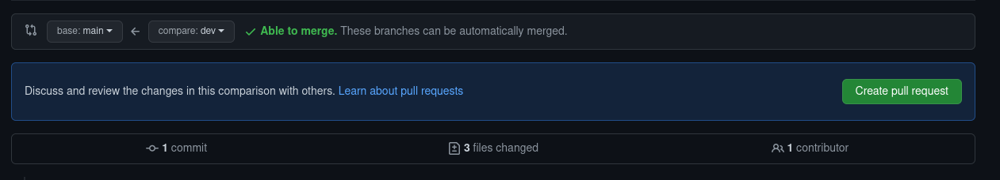

# Simple github How To

##  How to get sorces and work with

[Git docs](https://git-scm.com/doc) - here you can find good manuals for git

## 1. Clone repository
    
* Copy link from github

* Open terminal in your work directory and execute `git clone` command
    ```bash
    cd my-work-directory # moving to work dir
    git clone https://github.com/Playtronica/.github.git # cloninig repository from github
    ```
* Now you got sources from github to your computer

## 2. Work rules

*  Use branches for your changes
    ```sh
    git pull # before checkout make shure you get last changes from remote
    git checkout -b my-awesome-branch # checkout to your branch to isolate your work
    ```
* Commit results 
    ```sh
    git add names_of files_that_i # add files to commit
    git add want_to_commit # and anouther file that we want to add
    git status # make shure that everything is OK
    git commit # commit changes 

    # You also can write commit message in terinal
    git commit -m "Message describing my result"
    ```
* Write informatime messages for commits

## 3. Share your results to others

* Commit all changes that you want to share
* Push them to github
    ```sh
    git push 
    ```
* Create pull request
    
    1. Go to your branch on github
    
        

    2. Press on message desribing how much commits your branch ahead of main

        

    3. Press button `Create pull request`

        
